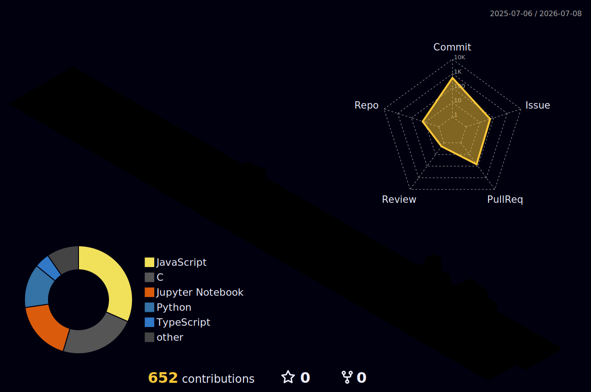

  <!-- Header: Lavender-pink gradient capsule with waving type -->
  
   

  <!-- Typing SVG for subtitle -->
  
  
  <!-- Hits Counter -->
  

 

## 💫 About Me

<table width="100%">
  <tr>
    <td width="60%" valign="top">
      <h3>👋 안녕하세요! 전기헌입니다.</h3>
      
새로운 기술을 학습하고 고도화된 백엔드 시스템을 설계하는 것에 깊은 관심을 가지고 있습니다.

      <ul>
        <li>🚀 <b>주요 관심사:</b> 분산 시스템 아키텍처, 성능 최적화, 인프라 자동화</li>
        <li>🌱 <b>공부 중인 분야:</b> 쿠버네티스 기반 컨테이너 오케스트레이션 및 마이크로서비스 설계</li>
        <li>💬 <b>토론 환영:</b> Java, Spring Boot, 데이터베이스 설계 및 클라우드 아키텍처</li>
      </ul>
    </td>
    <td width="40%" valign="top">
      <h3>📊 Quick Info</h3>
      <ul>
        <li>📍 <b>Location:</b> Seoul, South Korea</li>
        <li>💼 <b>Goal:</b> Backend & DevOps Developer</li>
        <li>⚡ <b>Motto:</b> "작동하는 코드를 넘어, 유지보수하기 좋고 변경에 유연한 구조를 지향합니다."</li>
      </ul>
    </td>
  </tr>
</table>

 

## 🛠️ Tech Stack & Skills

| Category | Technologies |
| :--- | :--- |
| **Backend & Languages** |  |
| **Database & Caching** |  |
| **DevOps & Infrastructure** |  |
| **Tools & Collaboration** |  |

 

## 🔮 3D Contribution Graph

  

 

## 📊 GitHub Analytics & Achievements

  

<table align="center" width="100%">
  <tr>
    <td align="center" width="50%">
      
    </td>
    <td align="center" width="50%">
      
    </td>
  </tr>
  <tr>
    <td align="center" colspan="2">
       
      
    </td>
  </tr>
</table>

 

## 📫 Connect with Me

  
  

