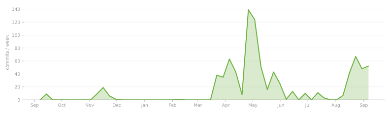

<h1 align="center">전기헌</h1>

  
  
  

  

 

<h3 align="center">🎓 Education</h3>

  
   
  

<h3 align="center">📜 Certification</h3>

  
  

<h3 align="center">💻 Project</h3>

<table align="center">
<tr>
<td width="420" valign="top">

**[MJU-OSS-MCP](https://github.com/Giheon-Jeon/MJU-OSS-MCP)**

자연어/조건 기반 항공권 검색 및 여행 플래닝 서비스
(공개SW실무 팀 프로젝트)

`TypeScript` `React`

</td>
<td width="420" valign="top">

**[MSG-CTF](https://github.com/MJSEC-MJU/MSG_CTF_WEB)**

MJSEC 주최 CTF 대회 웹 플랫폼
(진행 중)

`JavaScript`

</td>
</tr>
</table>

 

  

  

